

# eSvačina

**Healthy snacks that taste great.** 
A modern online shop for healthy food, snacks and ingredients, with recipes linked to every product.

🇨🇿 Čeština · 🇬🇧 English · Kč · € · $

 

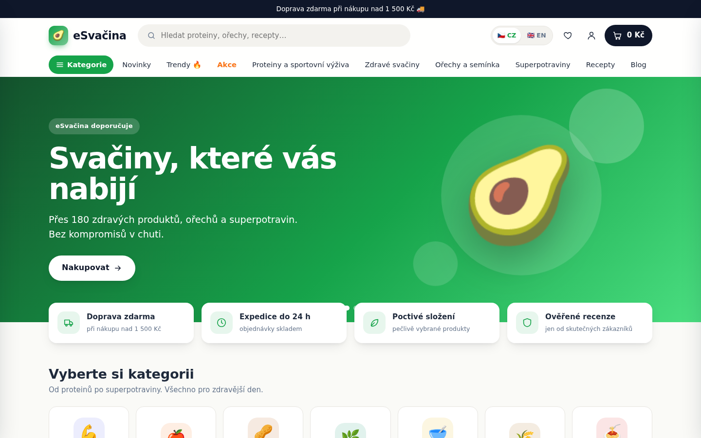

 

## ✨ Highlights

| | |
|---|---|
| 🛒 **Full shop** | 14 categories, 52 subcategories and 172 products with nutrition tables, ingredients and allergens |
| 🍳 **Recipes** | Every ingredient links to a product you can add to the basket in one click |
| ⭐ **Honest reviews** | Only customers who actually bought a product can review it |
| 💬 **Community** | Likes, dislikes, favourites and a Q&A section on every product |
| 🌍 **Two languages** | Czech and English, with prices in CZK, EUR or USD at the daily Czech National Bank rate |
| 🚚 **Czech carriers** | Zásilkovna, Balíkovna, Česká pošta, PPL, DPD, GLS and personal pickup |
| 💳 **Payments** | Cash on delivery, credit card and Stripe (Apple Pay, Google Pay, Link), plus bank transfer |
| 🔎 **SEO ready** | Server-rendered meta tags, structured data, sitemap and auto-generated share images |
| 🎛️ **Admin panel** | Every product, page, banner, colour and setting is editable without touching code |
| 📱 **Responsive** | Designed for phones, tablets and desktops |

 

## 🖼️ A closer look

<table>
  <tr>
    <td width="50%">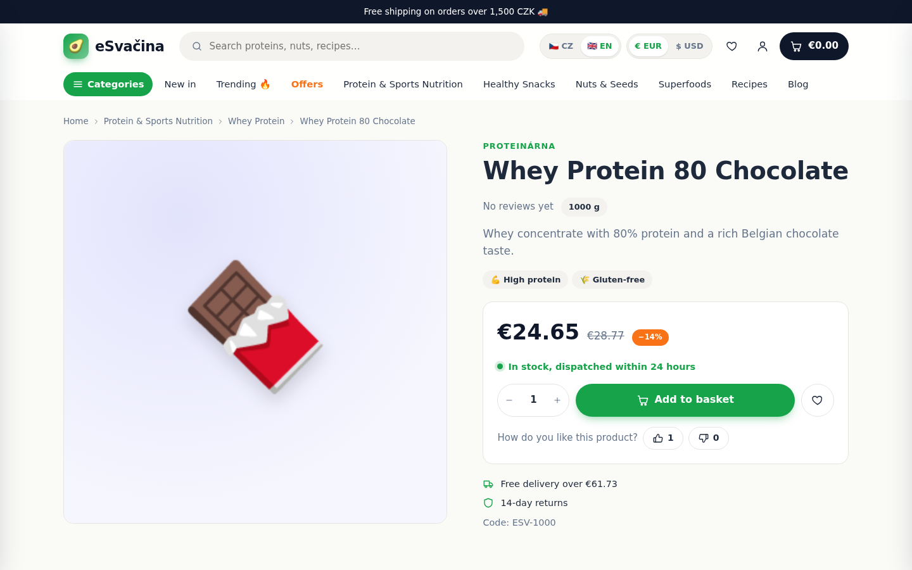 <b>Product page</b>: price in your currency, likes, favourites, stock and delivery info</td>
    <td width="50%">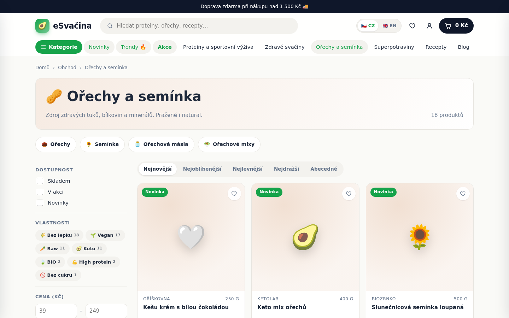 <b>Categories</b>: filters, sorting, subcategories and trending products</td>
  </tr>
  <tr>
    <td>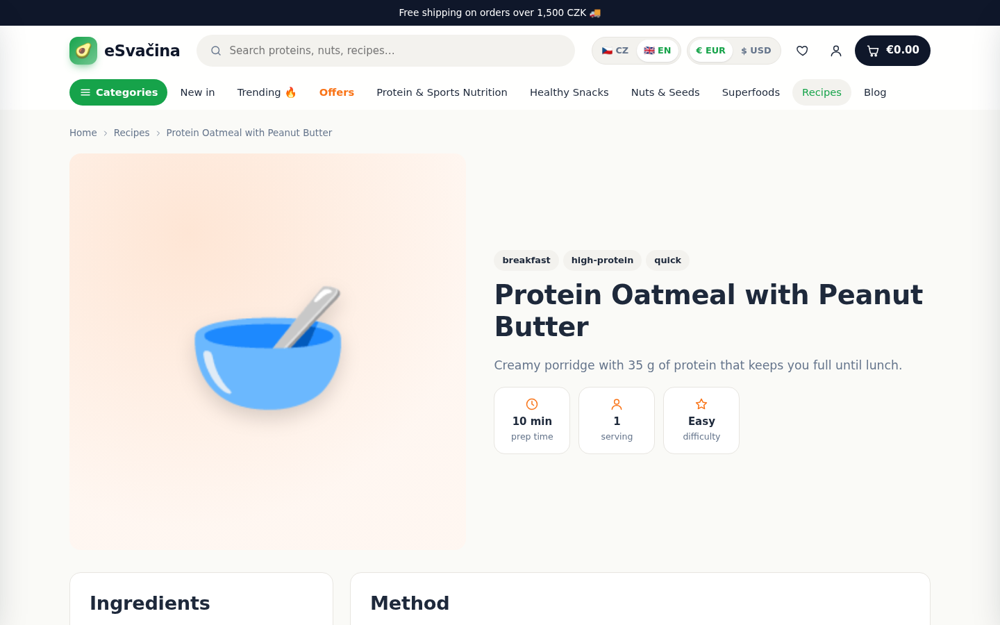 <b>Recipes</b>: ingredients linked straight to the shop</td>
    <td>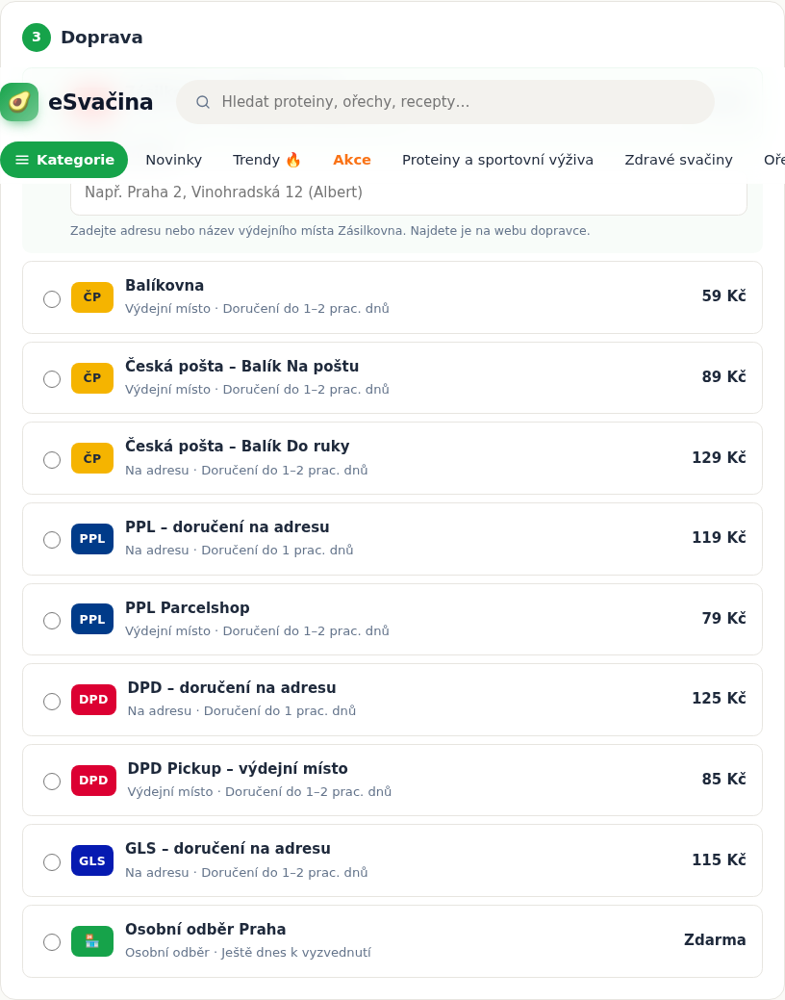 <b>Checkout</b>: Czech carriers with pickup points and delivery times</td>
  </tr>
  <tr>
    <td>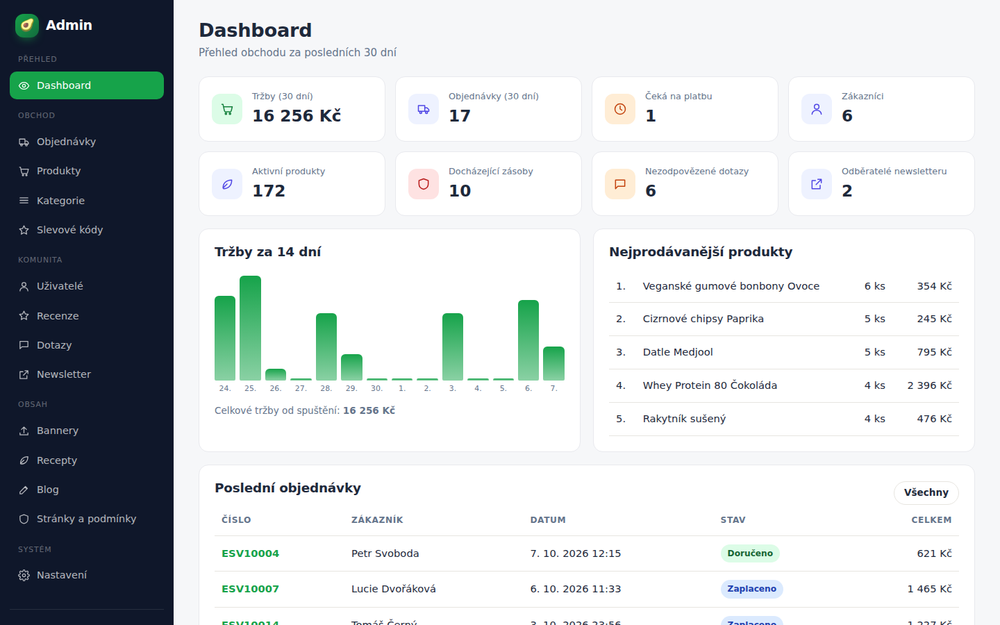 <b>Admin dashboard</b>: revenue, orders, best sellers and low stock</td>
    <td>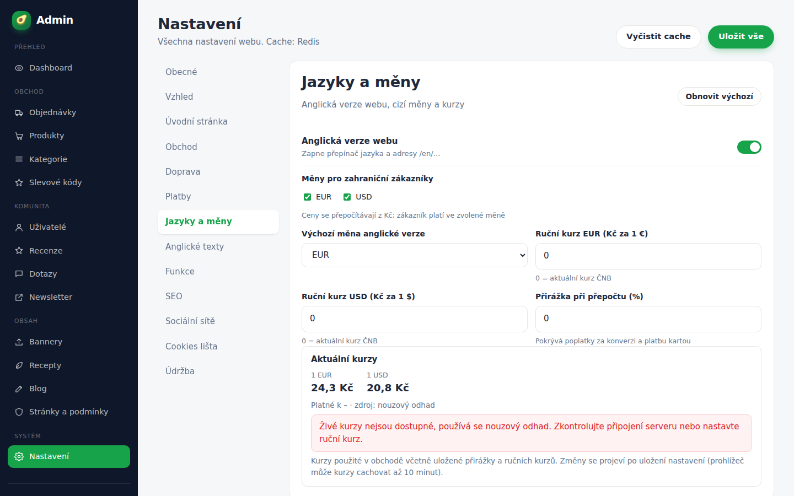 <b>Settings</b>: languages, currencies, carriers, payments, look and feel</td>
  </tr>
</table>

  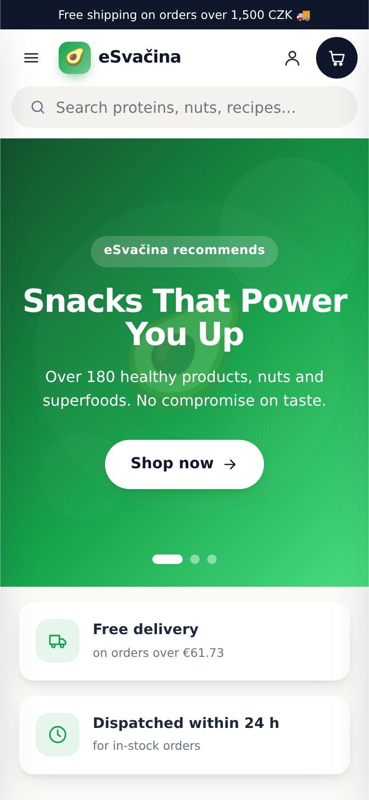
  &nbsp;
  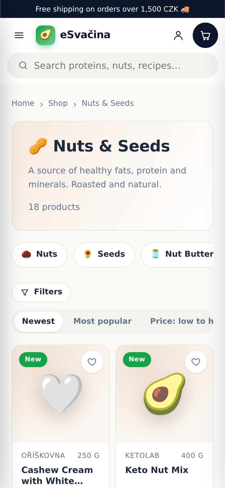
  &nbsp;
  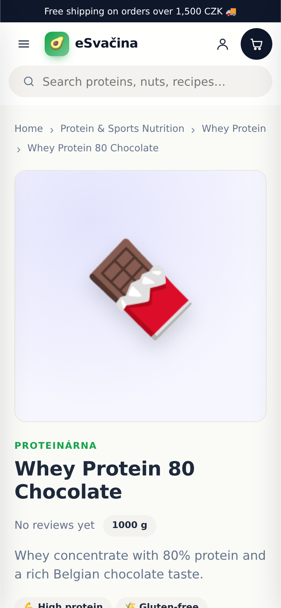
   <b>On the phone</b>: the same shop, made for thumbs

 

  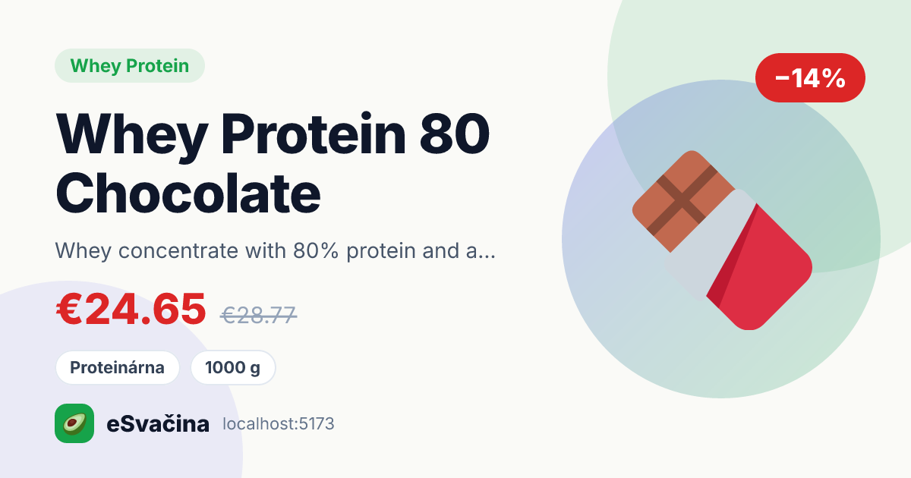
   <b>Share images</b>: every product, recipe and article gets its own preview card for social media

 

## 🛍️ For customers

- **Inspiring landing page** with banners, trending products, new arrivals, offers, recipes and blog posts
- **Smart search** with instant suggestions in both languages
- **Accounts** with order history, saved address, favourites, reviews and questions
- **Cart and checkout** with discount codes, free-shipping progress and guest checkout
- **Blog** with articles about nutrition and healthy eating
- **Clear legal pages**: terms and conditions, privacy policy, cookie policy, shipping and returns
- **Cookie consent** with necessary, analytics and marketing categories

## 🧑‍💼 For the shop owner

- **Dashboard** with revenue, orders, best sellers, low stock and unanswered questions
- **Products and categories** with images, descriptions, nutrition values and English translations
- **Orders** with a status workflow; cancelling an order returns its stock
- **Content**: banners, recipes, blog posts, pages and discount codes
- **Community moderation** for reviews and questions, with staff answers
- **Complete site settings**: name, contacts, colours, fonts, homepage sections, carriers, payments, exchange rates, SEO, social links, cookie texts and maintenance mode

## 🧱 Built with

| Layer | Technology |
|---|---|
| Storefront and admin | React 19, Vite, React Router |
| API | Node.js 22, Express 5, Prisma |
| Database | PostgreSQL 16 |
| Cache | Redis, with an in-memory fallback |
| Payments | Stripe Checkout |
| Share images | Satori and Resvg |
| Security | CORS, Helmet, rate limiting, bcrypt, httpOnly cookies, input validation |

 

## 🚀 Getting started

The shop runs with Docker in a single step, and comes with demo products, recipes, articles and accounts so you can explore it straight away.

Installation, configuration, demo logins and deployment notes are in **[docs/SETUP.md](docs/SETUP.md)**.

 

## 👤 Author

Designed and built by **Nikolas Malík**. 
🌐 [malikweb.eu](https://malikweb.eu) · GitHub [@GeronimoCZE](https://github.com/GeronimoCZE)

## 📄 License

Released under the [MIT License](LICENSE). © 2026 Nikolas Malík
